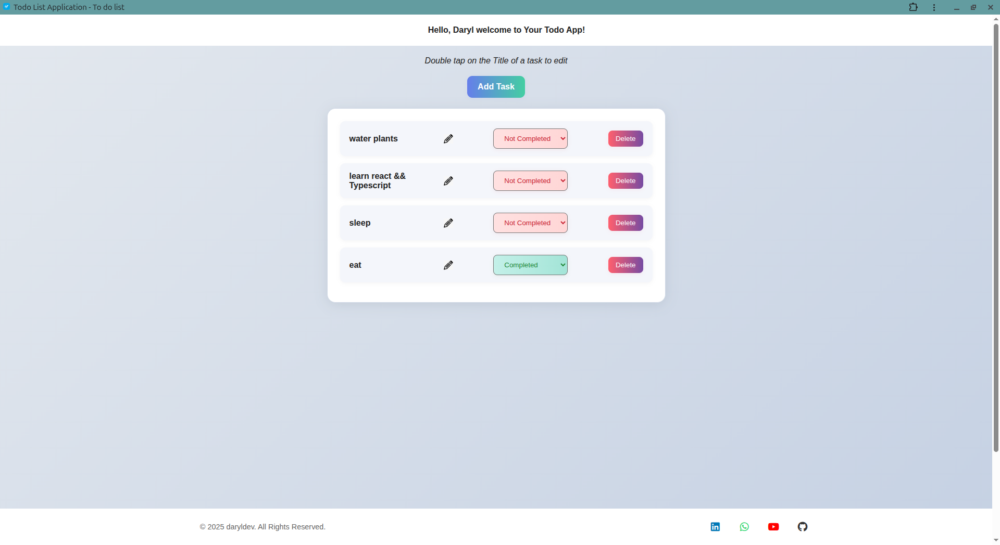
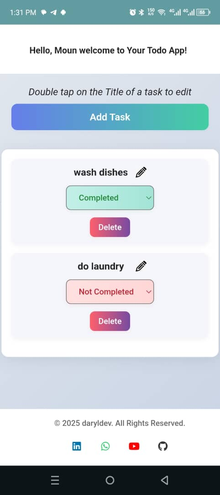

# Todo List App

A basic TypeScript todo list application for learning web development fundamentals.

## Features

- Add and delete tasks
- Edit task titles by double-clicking
- Mark tasks as completed/incomplete
- Data persistence using localStorage
- Basic responsive design
- Simple PWA setup

## 🚀 Live Demo

Check out the live application: [Todo List App](https://daryl-todo-list.netlify.app/)

## 📸 Screenshots

### Desktop View


### Mobile View


## Technologies Used

- TypeScript for type safety
- HTML5 and CSS3
- localStorage for data persistence
- Basic service worker implementation

## Project Structure

```
├── index.html              # Main HTML file
├── script.ts               # TypeScript source code
├── script.js               # Compiled JavaScript
├── style.css               # Styling and responsive design
├── service-worker.js       # PWA offline functionality
├── manifest.json           # Web app manifest
├── types.ts                # TypeScript type definitions
├── tsconfig.json           # TypeScript configuration
├── package.json            # Project dependencies and scripts
├── concepts.md             # Comprehensive programming concepts documentation
└── images/                 # App icons and assets
    ├── app_icon256.png     # PWA app icon
    ├── favicon.ico         # Browser favicon
    └── edit.png            # Edit indicator icon
```

## Getting Started

1. Clone the repository
2. Compile TypeScript: `npx tsc`
3. Open `index.html` in a browser

## Usage

- Click "Add Task" to create new tasks
- Double-click task titles to edit them
- Use dropdown to mark tasks as completed
- Click "Delete" to remove tasks

## Code Structure

Basic organization with TypeScript interfaces and event handling.

## Learning Concepts

This project covers basic web development concepts. See [concepts.md](./concepts.md) for detailed explanations of:

- TypeScript interfaces and type safety
- DOM manipulation and event handling  
- localStorage for data persistence
- Basic CSS styling and responsive design
- Simple service worker implementation

## Data Structure

```typescript
interface Todo {
    id: number;
    title: string;
    completed: boolean;
}
```

Data is stored in localStorage as JSON.
- Null safety with optional chaining
- Event type casting for proper handling

## Troubleshooting

### Common Issues

1. **TypeScript compilation errors**: Ensure all types are properly defined
2. **Module loading issues**: Use a local server instead of opening files directly
3. **Data not persisting**: Check if localStorage is enabled in browser
4. **Responsive issues**: Test with browser developer tools

### Development Tips

- Use `npx tsc --watch` for automatic compilation during development
- Check browser console for any JavaScript errors
- Test on multiple devices and browsers
- Use browser developer tools for debugging


## Author

**DarylDev**
- GitHub: [daryldewilde](https://github.com/daryldewilde)
- LinkedIn: [Daryl Dewilde](https://www.linkedin.com/in/nfoye-djomo-daryl-dewilde-0ba897311/)
- YouTube: [@daryldev](https://youtube.com/@daryldev)

## Contributing

1. Fork the repository
2. Create a feature branch (`git checkout -b feature/amazing-feature`)
3. Commit your changes (`git commit -m 'Add amazing feature'`)
4. Push to the branch (`git push origin feature/amazing-feature`)
5. Open a Pull Request

---

**Built with TypeScript for learning and demonstration purposes**
